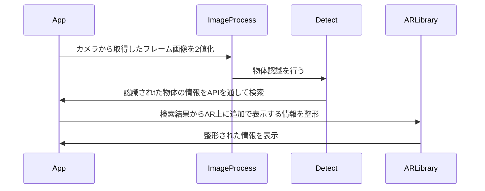

# Self PR Slide 

天羽大樹ってどんな人？

<div class="text-gray">
  背景画像著作者：
  <a href="https://jp.freepik.com/free-vector/blue-copy-space-digital-background_12067358.htm#query=%E9%9D%92%E3%81%84%E5%A3%81%E7%B4%99&position=0&from_view=keyword&track=sph&uuid=23a178ee-d3cc-4d4c-af45-7b573662feff" class="text-gray">Freepik</a>
</div>

<!-- <div class="pt-12">
  <span @click="$slidev.nav.next" class="px-2 py-1 rounded cursor-pointer" hover="bg-white bg-opacity-10">
    Press Space for next page <carbon:arrow-right class="inline"/>
  </span>
</div> -->

<div class="abs-br m-6 flex gap-2">
  <button @click="$slidev.nav.openInEditor()" title="Open in Editor" class="text-xl icon-btn opacity-50 !border-none !hover:text-white">
    <carbon:edit />
  </button>
  <a href="https://github.com/slidevjs/slidev" target="_blank" alt="GitHub"
    class="text-xl icon-btn opacity-50 !border-none !hover:text-white">
    <carbon-logo-github />
  </a>
</div>

<!--
The last comment block of each slide will be treated as slide notes. It will be visible and editable in Presenter Mode along with the slide. [Read more in the docs](https://sli.dev/guide/syntax.html#notes)
-->

---

# スキル情報

- 📝 **主に扱うプログラミング言語** - Python,TypeScript,Rust
- 🎨 **興味のある分野** - フロントエンド開発、フルスタック開発
- 🧑‍💻 **チームでの開発経験** -ハッカソンや授業内でチーム内の開発活動をマネジメントした経験アリ
- 🤹 **研究している内容** - WebAssembly(Rust),Reactで高速描画WebAR開発
- 📤 **課外プロジェクトでの活動** - 「Tourism」という学内非公式プロジェクトで後輩の成果物開発支援
- 🎥 **プログラミング以外のスキル** - Canvaでのスライド作成、Aviutilでの動画作成


<!--
You can have `style` tag in markdown to override the style for the current page.
Learn more: https://sli.dev/guide/syntax#embedded-styles
-->

<style>
h1 {
  background-color: #2B90B6;
  background-image: linear-gradient(45deg, #4EC5D4 10%, #146b8c 20%);
  background-size: 100%;
  -webkit-background-clip: text;
  -moz-background-clip: text;
  -webkit-text-fill-color: transparent;
  -moz-text-fill-color: transparent;
}
</style>


---

# プログラミング言語の選定について

## 主な理由
1. **型安全**：型定義が厳密に定義できることによる安全性が見込める
2. **書いた後の見やすさ**：言語について詳しくなくても読みやすいか（学習コストが低い）
3. **その言語でのみできることがあるか**：開発したいものがその言語だからこそできるものであるかどうか

<div class="flex flex-row justify-between mt-5">
  <div>
    <h2 class="text-center">1</h2>
    <div class="bg-slate-200 rounded-xl border p-5 flex gap-4">
      <div>
        <Rust />
      </div>
      <div>
        <TypeScript />
      </div>
    </div>
  </div>
  <div>
    <h2 class="text-center">2</h2>
    <div class="bg-slate-200 rounded-xl border p-5 flex gap-4">
      <div>
        <TypeScript />
      </div>
      <div>
        <Python />
      </div>
    </div>
  </div>
  <div>
    <h2 class="text-center">3</h2>
    <div class="bg-slate-200 rounded-xl border p-5 grid grid-cols-2 grid-rows-2 gap-4">
      <div class="col-span-2 row-span-1 flex justify-center items-center">
        <Rust />
      </div>
      <div >
        <TypeScript />
      </div>
      <div>
        <Python />
      </div>
    </div>
  </div>
</div>

<style>
h1 {
  background-color: #2B90B6;
  background-image: linear-gradient(45deg, #4EC5D4 10%, #146b8c 20%);
  background-size: 100%;
  -webkit-background-clip: text;
  -moz-background-clip: text;
  -webkit-text-fill-color: transparent;
  -moz-text-fill-color: transparent;
}
</style>


---

# 興味のある分野(フロントエンド開発)について学んできたこと
<div class="flex gap-8 flex-wrap">
  <div class="border p-5 rounded-xl bg-slate-100">
    <h3  class="font-bold"><span class="line-through decoration-yellow-300/35 decoration-25">React</span>,Vue.js,Solid.js</h3>
    <ul>　
      <li>JSX構文</li>
      <li>特定の機能を持ったHooksという関数</li>
    </ul>
    <br />
    <br />
  </div>
  <div class="border p-5 rounded-xl bg-slate-100">
      <h3  class="font-bold"><span class="line-through decoration-yellow-300/35 decoration-25">Next.js</span></h3>
      <div>先述した学習に加え、</div>
      <ul>
        <li>App Router , Route Handler</li>
        <li>Server Action</li>
        <li>(Client/Server) Component</li>
      </ul>
  </div>
  <div class="border p-5 rounded-xl bg-slate-100">
    <h3 class="font-bold">Firebase,Supabase,<span class="line-through decoration-yellow-300/35 decoration-25">Convex</span></h3>
    <ul>
      <li>データベース機能</li>
      <li>OAuthの活用</li>
    </ul>
  </div>
  <div class="border p-5 rounded-xl bg-slate-100">
    <h3 class="font-bold">microCMS,<span class="line-through decoration-yellow-300/35 decoration-25">Newt</span></h3>
    <ul>
      <li>コンテンツのスキーマ登録</li>
      <li>保存したコンテンツをプログラムで取得</li>
      <li>上記サービスを使ったブログ開発</li>
    </ul>
  </div>
</div>

<style>
h1 {
  background-color: #2B90B6;
  background-image: linear-gradient(45deg, #4EC5D4 10%, #146b8c 20%);
  background-size: 100%;
  -webkit-background-clip: text;
  -moz-background-clip: text;
  -webkit-text-fill-color: transparent;
  -moz-text-fill-color: transparent;
}
</style>


---

# チームでの開発経験
### ハッカソンでの開発経験
DMM協賛のハッカソンに同じ学年のメンバー3人と一緒に参加し、<br/>
学外の技術イベントの情報を取得しポップアップ表示するChrome拡張機能を開発した。
- フロントエンド（表示部分作成）（TypeScript）：僕
- バックエンド（API作成）（Python）：メンバー3人

という分担になった。<br/>
### 工夫
- 開発円滑化のため、**Plasmo**という拡張機能開発フレームワークを用いた
- 普段はTailwindCSSを使っているが、表示するサイトのスタイル設定との衝突を避けるためにCSSファイルにCSSを記述した

<style>
h1 {
  background-color: #2B90B6;
  background-image: linear-gradient(45deg, #4EC5D4 10%, #146b8c 20%);
  background-size: 100%;
  -webkit-background-clip: text;
  -moz-background-clip: text;
  -webkit-text-fill-color: transparent;
  -moz-text-fill-color: transparent;
}
</style>


---

```yaml
layout: two-cols
```

# 研究している内容の詳細

## 概要
WebAssembly(Rust),Reactで高速描画WebAR開発
## 開発言語
Rust,WebAssembly,TypeScript
## 使用ライブラリ
- DOM出力 :Leptos
- 画像処理：Photon
- AIモデル活用：ORT
- ARコンテンツ操作：未定（A-Frame,AR.js,Mind-AR）

::right::
## アプリの動作の概要

<br />

## 研究を始めた理由
- AR技術というのは今後、人々がより安全にデバイスを用いて生活するために必要になる技術であると考えたため。
- 現在販売されているARデバイスは非常に高価であるため、低コストで扱えるARアプリ実行環境としてWebの仕組みを扱いたいと考えたため。

<style>
h1 {
  background-color: #2B90B6;
  background-image: linear-gradient(45deg, #4EC5D4 10%, #146b8c 20%);
  background-size: 100%;
  -webkit-background-clip: text;
  -moz-background-clip: text;
  -webkit-text-fill-color: transparent;
  -moz-text-fill-color: transparent;
}
</style>


---

# プログラミング以外のスキルについての詳細
<div class="flex">
  <div class="basis-1/2">

  ### Canvaを扱ったスライド作成
  授業やハッカソンでの発表において、スライドを作成する際、<br/>
  **Canva**を扱ってスライドを作っています。

  

  </div>
  <div class="basis-1/2">

  ### Aviutilを扱った動画作成
  中学生の頃に動画投稿をしていたことがあり、現在も<br/>動画を作ることができます。近頃は**Remotion**という<br />npmパッケージを用いてプログラムで動画を作成していますが、<br />
  クロマキー合成や字幕を入れるなど、情報をフォームから<br/>取得しなければならないインタラクティブなものではないものや、<br/>特にオシャレな動きをつけたい動画は**Aviutil**で作っています

  </div>
</div>

<style>
h1 {
  background-color: #2B90B6;
  background-image: linear-gradient(45deg, #4EC5D4 10%, #146b8c 20%);
  background-size: 100%;
  -webkit-background-clip: text;
  -moz-background-clip: text;
  -webkit-text-fill-color: transparent;
  -moz-text-fill-color: transparent;
}
</style>


---

```yaml
layout: two-cols
```

# 課外プロジェクトでの活動概要


### 後輩の成果物開発支援

- コンテンツを作成する上でのライブラリ・フレームワークの紹介

後輩が作成したいコンテンツを開発する上で<br/>役に立つライブラリや、
フレームワークを、<br/>
後輩が知っている言語や作成するコンテンツの特徴に合わせ、<br />
紹介を行う

- コンテンツに必要な処理の要件定義支援

作成したいコンテンツの概要を聞き取り、<br/>
**基本的な機能についてのみ**要件定義の支援を行う。
それ以降の機能についてはヒントとなるアドバイスのみを与える

#### 上記の活動を通し

後輩自身の論理的思考力を養うことをコンテンツ開発を通して<br/>
促進する。

::right::

<div class="mt-14" />

### Webアプリケーション開発

- (日常/学生)生活に役立つWebアプリケーション開発

学内非公認プロジェクトとして存在しているため、<br/>
先輩方とは違った道で公認プロジェクト化を目指し、<br/>
新しいプロジェクト内の活動内容として、<br/>
日常生活や、学生生活の中で活用できる<br/>
Webアプリケーション開発を行っている<br/>

<style>
h1 {
  background-color: #2B90B6;
  background-image: linear-gradient(45deg, #4EC5D4 10%, #146b8c 20%);
  background-size: 100%;
  -webkit-background-clip: text;
  -moz-background-clip: text;
  -webkit-text-fill-color: transparent;
  -moz-text-fill-color: transparent;
}
</style>
